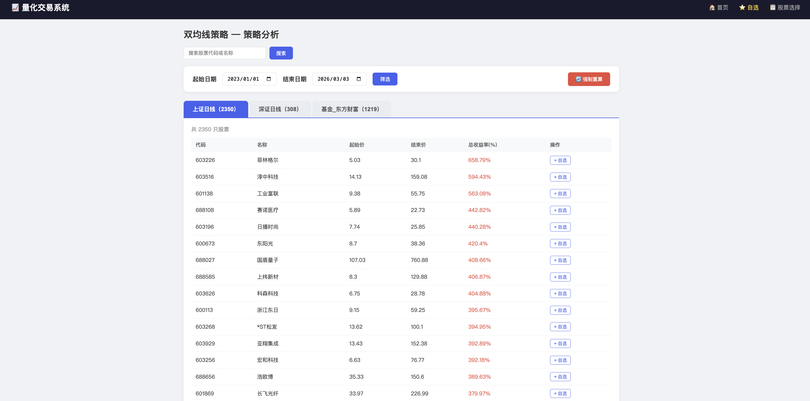
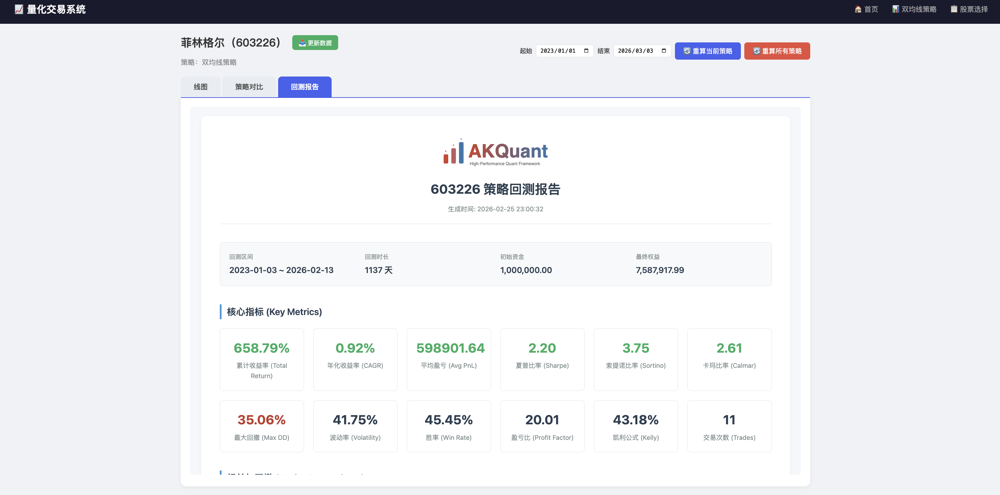
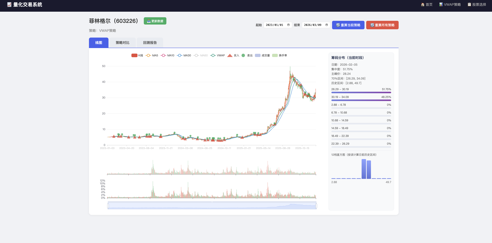
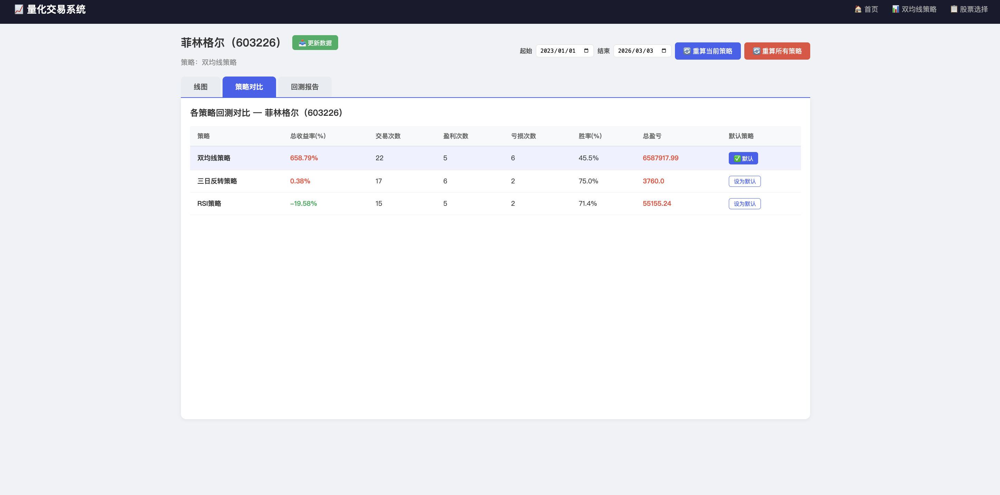

# QuantWeb 量化交易系统

基于 Django + AkShare + AkQuant 的量化回测与数据分析平台，支持 A 股/ETF 数据管理、策略分析、单股回测详情查看与交易信号展示。

## 项目功能

- 首页看板：上证/深证/ETF 数据量与更新时间
- 数据更新：增量更新、更新当日数据（单独功能）
- 策略分析：按板块汇总收益率并排序
- 单股详情：K 线、交易信号、回测报告
- 自选股：维护关注标的与默认策略

## 内置策略

- `DualMA`（双均线）
- `ThreeDayReverse`（三日反转）
- `RSI`

## 目录结构

```text
akshare_proj/
├── QuantWeb/                  # Django 项目
│   ├── manage.py
│   └── QuantWeb/
│       ├── views.py
│       ├── urls.py
│       ├── myStrategy/
│       └── templates/
├── data/
│   ├── stock_sh_a_spot_em.csv
│   ├── stock_sz_a_spot_em.csv
│   ├── fund_etf_spot_em_eastmoney.csv
│   ├── 上证日线/
│   ├── 深证日线/
│   ├── 基金_东方财富/
│   └── daily_all/
├── data_download/
├── picture/
└── chat_guide.md
```

## 页面截图

### 首页
)

### 策略分析


### 回测报告


### 交易信息


### 单股策略对比


## 快速启动

```bash
cd QuantWeb
python manage.py runserver 0.0.0.0:8000
```

访问地址：`http://localhost:8000/`

## 数据说明

- 股票映射：
	- `data/stock_sh_a_spot_em.csv`
	- `data/stock_sz_a_spot_em.csv`
- ETF 映射：
	- `data/fund_etf_spot_em_eastmoney.csv`
- 日线数据：
	- `data/上证日线/`
	- `data/深证日线/`
	- `data/基金_东方财富/`
- 当日快照：
	- `data/daily_all/stock_zh_a_spot_em_YYYYMMDD.csv`

## 开发指南

详细开发说明见：`chat_guide.md`
